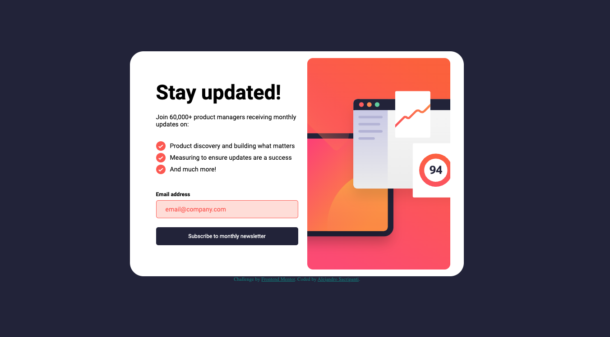

# Frontend Mentor - Newsletter sign-up form with success message solution

## Table of contents

- [Frontend Mentor - Newsletter sign-up form with success message solution](#frontend-mentor---newsletter-sign-up-form-with-success-message-solution)
  - [Table of contents](#table-of-contents)
    - [Screenshot](#screenshot)
    - [Links](#links)
    - [Built with](#built-with)
    - [What I learned](#what-i-learned)
    - [Continued development](#continued-development)
  - [Author](#author)

Users should be able to:

- Add their email and submit the form
- See a success message with their email after successfully submitting the form
- See form validation messages if:
  - The field is left empty
  - The email address is not formatted correctly
- View the optimal layout for the interface depending on their device's screen size
- See hover and focus states for all interactive elements on the page

### Screenshot

### Links

- Live Site URL: https://asacripanti.github.io/newsLetterSignUp/

### Built with

- Semantic HTML5 markup
- CSS custom properties
- Flexbox
- Javascript

### What I learned

One thing I learned doing this project was how to change the order of the elements being displayed with flexbox. I was a little stumped once I started working on the mobile layout. My basic layout for this app involved one parent container with 2 children that hold the text container and the image container for the left and right sides. 
I used flexbox with a flex-direction of flex to align the children. When styling for mobile, I changed the flex direction of the container to row. My problem was that I needed the img to be on top of the text but it was at the bottom because it's the second child. 
After googling a bit, I stumbled upon the reverse property for flex-direction, this allowed me to move the img child to be on top. 
It was really cool to learn a little trick like that from this project. 

### Continued development

Something I want to continue looking into is the img position/scaling in the mobile layout. I had a bit of trouble matching the sample img, my img was focused on a slightly different section of the picture.

## Author

- Website - https://asacripanti.github.io/portfolio/
- Frontend Mentor - https://www.frontendmentor.io/profile/asacripanti
- Github: https://github.com/asacripanti/
- Linkedin: https://www.linkedin.com/in/alejandro-sacripanti-7abaa823a/

